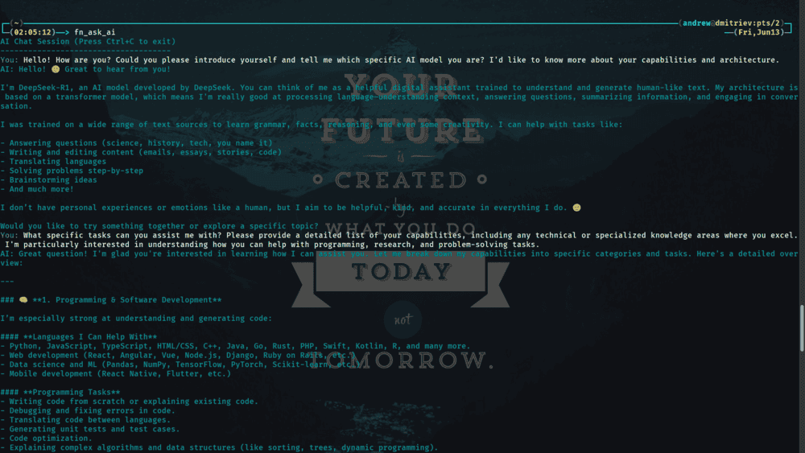

# ZSH Functions Library

A comprehensive collection of ZSH functions designed to streamline development workflows, automate routine tasks, and enhance productivity on Arch Linux systems.

## Table of Contents

- [Overview](#overview)
- [Dependencies](#dependencies)
- [Installation](#installation)
- [Functions Reference](#functions-reference)
  - [Media Processing](#media-processing)
    - [fn_optimize_images](#fn_optimize_images)
    - [fn_youtube_video_translate](#fn_youtube_video_translate)
    - [fn_convert_media](#fn_convert_media)
    - [fn_convert_media_batch](#fn_convert_media_batch)
  - [Development Tools](#development-tools)
    - [fn_ask_ai](#fn_ask_ai)
    - [fn_git_clone_template](#fn_git_clone_template)
    - [fn_init_repo](#fn_init_repo)
  - [File Generators](#file-generators)
  - [Template Requirements](#template-requirements)

## Overview

This collection provides custom ZSH functions that automate common development and system administration tasks. Each function is designed to be modular, efficient, and easy to use with sensible defaults.

### Key Features
- **Media Processing**: Batch convert, optimize images, download and translate YouTube videos
- **Development Utilities**: Template-based project scaffolding, Git workflow enhancements
- **System Integration**: Generate systemd services, timers, and desktop entries
- **Smart Defaults**: All functions work with minimal configuration while supporting advanced options

## Dependencies

- `ZSH` 5.0+ - shell environment
- `git` - version control for Git-related functions
- `nodejs` & `npm` - required for SVGO and other Node.js based tools
- `jq` - JSON processor for AI chat functionality
- `curl` - HTTP client for API communication
- `ffmpeg` - media conversion and processing
- `yt-dlp` - YouTube video downloading
- `vot-cli` - video translation
- `pngquant` - PNG optimization
- `jpegoptim` - JPEG optimization
- `webp` - WebP support (cwebp utility)
- `imagemagick` - AVIF support
- `svgo` - SVG optimization (installed via npm)

### Optional
- [Oh-My-ZSH](https://github.com/ohmyzsh/ohmyzsh/) - enhanced shell experience

> **Note:** Each function checks for its required dependencies at runtime and provides helpful error messages if any are missing.

## Installation

1.  **Create the `.zfunc` directory** in your home folder if it doesn't exist:
    ```bash
    mkdir -p ~/.zfunc
    ```
2.  **Place the function files** into `~/.zfunc`. You can either copy them or create symbolic links.

    **Option A: Copy Files**
    ```bash
    # Copy all functions from the cloned repository
    cp /path/to/ArchLinux-utility-belt/.zfunc/* ~/.zfunc/
    ```
    
    **Option B: Create Symbolic Links (Recommended)**
    This method keeps the functions updated with the repository.
    ```bash
    # Link all functions with a single command
    ln -s /path/to/ArchLinux-utility-belt/.zfunc/* ~/.zfunc/
    ```
    *Replace `/path/to/ArchLinux-utility-belt/` with the actual path to the cloned repository.*

3.  **Add the following lines** to your `.zshrc` file to enable autoloading:
    ```zsh
    # Add .zfunc directory to fpath
    fpath+=($HOME/.zfunc)

    # Autoload all functions in .zfunc
    autoload -Uz $HOME/.zfunc/*(:t)
    ```

4.  **Reload your ZSH configuration** to apply the changes:
    ```bash
    source ~/.zshrc
    ```
    or
    ```bash
    exec zsh
    ```
See [configs/.zshrc](../configs/.zshrc) for a complete configuration example.

## Functions Reference

All functions in this library support `-h` and `--help` flags to display a quick help message with usage instructions and available options.

### Media Processing

#### fn_optimize_images

Optimizes images in a source directory and saves the results to a target directory. Automatically selects the appropriate tool for each format: `pngquant` for PNG, `jpegoptim` for JPEG, `cwebp` for WEBP, `svgo` for SVG, and `magick` for AVIF.

**Usage:**  
```bash
  fn_optimize_images [input_folder] [output_folder]
```

**Arguments:**
- `input_folder` (optional): Source directory (default: current directory)
- `output_folder` (optional): Destination directory (default: current directory)

**Behavior:**
1. Checks if the input and output folders exist; if not, creates the output folder.
2. Identifies image formats in the input folder and selects the appropriate optimization tool for each.
3. Creates a timestamped subfolder in the output directory if the input and output directories are the same.
4. Optimizes images using the following quality settings:
   - **PNG**: Quality 75-80 using pngquant
   - **JPEG**: Maximum quality 70 using jpegoptim
   - **WEBP**: Quality 70 using cwebp
   - **SVG**: Lossless optimization using svgo
   - **AVIF**: Quality 60 using magick
5. Saves the optimized images to the output folder.
6. Logs the optimization process and any errors encountered.

**Requires:** `pngquant`, `jpegoptim`, `webp`, `imagemagick`, `svgo` (installed via `npm`)

**Supported formats:** png, jpg, jpeg, webp, svg, avif.

**Notes:**
When both input and output folders point to the current directory, or when the specified output folder does not exist, a timestamped subfolder will be created automatically (format: img_DD-MM-YYYY_HH:MM:SS) to prevent overwriting original images.

**Example:**
```bash
fn_optimize_images ~/pictures/raw ~/pictures/optimized
```

#### fn_youtube_video_translate

Downloads a YouTube video, translates its audio track to Russian using `vot-cli` and Yandex API, and merges the translated audio with the original video using `ffmpeg`. Uses Firefox cookies for `yt-dlp` by default - adjust or remove `--cookies-from-browser firefox` if you use a different browser. The `--concurrent-fragments 24` option in `yt-dlp` enables parallel downloads; reduce this value on low-performance systems.

**Usage:**  
```bash
  fn_youtube_video_translate project_name video_url
```

**Arguments:**
- `project_name` (required): Name for the project folder and output files
- `video_url` (required): YouTube video URL

**Behavior:**
1. Creates project directory: `~/videos/translate/src/<project_name>/`
2. Uses `vot-cli` to extract and translate audio to MP3 format
3. Downloads video using `yt-dlp` with best quality MP4 format
4. Merges original video with translated audio using `ffmpeg`
5. Outputs final video as: `~/videos/translate/<project_name>_final.mp4`
6. Warns if project directory already exists and asks for confirmation
7. Automatically cleans up temporary files if process fails

**Requires:** `vot-cli`, `yt-dlp`, `ffmpeg`

**Note:** Requires hardware acceleration support for optimal performance. The function uses `--hwaccel auto` to automatically detect available acceleration.

**Example:**
```bash
fn_youtube_video_translate my_project https://www.youtube.com/watch?v=dQw4w9WgXcQ
```

#### fn_convert_media

Converts a single audio or video file to a different format.

**Usage:**
```bash
  fn_convert_media input_file output_extension [ffmpeg_options]
```

**Arguments:**
- `input_file` (required): Path to source file
- `output_extension` (required): Target format (e.g., mp4, mkv, mp3)
- `ffmpeg_options` (optional): Additional FFmpeg parameters

**Behavior:**
1. Checks if the input file exists; exits with an error if it doesn't.
2. Constructs the output filename by replacing the input file extension with the specified output extension.
3. Utilizes `ffmpeg` to convert the media, applying any additional options provided.
4. Outputs the converted file in the same directory as the input file.
5. Logs the conversion process and any errors encountered.

**Requires:** `ffmpeg`

**Supported formats:**
- Audio: mp3, aac, m4a, flac, wav, ogg, opus
- Video: mp4, mkv, avi, mov, webm, flv, wmv

**Examples:**
```bash
fn_convert_media video.mp4 mkv
fn_convert_media audio.wav mp3 -b:a 320k

# Conversion with custom ffmpeg options for hardware acceleration
fn_convert_media video.mp4 mkv -c:v h264_nvenc -c:a copy
```

#### fn_convert_media_batch

Batch converts all media files in a directory to a specified format.

**Usage:**
```bash
  fn_convert_media_batch input_folder output_folder output_extension [ffmpeg_options]
```

**Arguments:**
- `input_folder` (required): Source directory
- `output_folder` (required): Destination directory
- `output_extension` (required): Target format
- `ffmpeg_options` (optional): Additional FFmpeg parameters

**Behavior:**
1. Checks if the input and output folders exist; creates the output folder if it doesn't exist.
2. Iterates through all files in the `input_folder`.
3. For each file, constructs the output filename by placing it in the `output_folder` and changing its extension to the specified `output_extension`.
4. Utilizes `ffmpeg` to convert each media file, applying any additional `ffmpeg_options` provided.
5. Outputs converted files to the `output_folder`.
6. Logs the conversion process for each file and any errors encountered.

**Requires:** `ffmpeg`

**Supported Formats:**
- Audio: mp3, aac, m4a, flac, wav, ogg, opus
- Video: mp4, mkv, avi, mov, webm, flv, wmv

**Example:**
```bash
fn_convert_media_batch . . wav
fn_convert_media_batch ~/videos/raw ~/videos/converted mkv "-c:v libx265"
```

### Development Tools

#### fn_git_clone_template

Clones a repository as a template, removing Git history and reinitializing.

**Usage:**
```bash
fn_git_clone_template repo_url [branch] [project_name]
```

**Arguments:**
- `repo_url` (required): Git repository URL (HTTPS or SSH)
- `branch` (optional): Source branch (default: master)
- `project_name` (optional): New project directory name

**Behavior:**
- If source-branch is omitted, master is used.
- If new-project-name is omitted, files are copied into the current working directory.
- The original .git directory is removed. A new Git repository is initialized.

**Requires:** `git`

**Examples:**
```bash
fn_git_clone_template https://github.com/user/template.git
fn_git_clone_template git@github.com:user/template.git main my-project
```

#### fn_ask_ai

Command-line interface for AI-powered chat using OpenRouter API, featuring context-aware conversations with persistent history.



**Usage:**  
```bash
  fn_ask_ai [Arguments]
```

**Arguments:**
- `-h`, `--help` (optional):  Show help message and exit

**Features:**
- Interactive chat interface with context awareness (maintains last 10 messages)
- Colorized terminal output
- Secure API key handling through environment variables
- Error handling for network and API issues
- Multi-line input support
- Graceful exit on Ctrl+C

**Environment Setup:**

Get API key: https://openrouter.ai/keys

**Option 1 (Recommended):** Using a secure secrets file
```bash
# 1. Create a secure directory for secrets
mkdir -p ~/.secrets
chmod 700 ~/.secrets

# 2. Add your API key to a secure file
echo 'export OPENROUTER_API_KEY="your_api_key_here"' > ~/.secrets/api_keys
chmod 600 ~/.secrets/api_keys

# 3. Add to ~/.zshrc
echo 'source ~/.secrets/api_keys' >> ~/.zshrc
source ~/.zshrc
```

**Option 2:** Directly in shell config
```bash
# Add to ~/.zshrc
export OPENROUTER_API_KEY='your_api_key_here'
```

Important: If you're using version control, add this line to your ~/.gitignore to prevent committing sensitive data:
```
.secrets/
```

**Requires:**
- `curl` (v7.68.0+) - HTTP client
- `jq` (v1.6+) - JSON processor

**Examples:**
```bash
# Start an interactive chat session
fn_ask_ai

# Show help message
fn_ask_ai --help
```

**Troubleshooting:**
- "jq: command not found" - Install with: `sudo pacman -S jq`
- "curl: command not found" - Install with: `sudo pacman -S curl`
- "OPENROUTER_API_KEY not set" - Ensure it's exported in your shell configuration
- "Error: Network error" - Check your internet connection or proxy settings
- "API Error: ..." - Verify your API key and account status at [OpenRouter](https://openrouter.ai/keys)

**Notes:**
- Uses the `deepseek/deepseek-r1-0528-qwen3-8b:free` model by default
- Conversation history is maintained in memory during the session
- API key is never logged or displayed
- All API communication is encrypted (HTTPS)
- Error messages are displayed in red for better visibility

#### fn_init_repo

Initializes a new Git repository with optional template files. Creates a new directory (if specified) and initializes it as a Git repository, then copies common template files from the user's template directory if they exist.

**Usage:**
```bash
  fn_init_repo [repo_name]
```

**Arguments:**
- `repo_name` (optional): Name for the new repository. Can include a path (e.g., `./path/new-repo-name`). If not provided, uses the current directory.

**Behavior:**
- Creates the specified directory if it doesn't exist
- Initializes a new Git repository
- Copies the following `.gitignore` and `.dockerignore` from `~/templates/` if they exist
- Provides helpful error messages for common issues

**Template Requirements:** For full functionality, ensure you have `.gitignore` and `.dockerignore` template files in your `~/templates/` directory.

**Requires:** `git`

**Example:**
```bash
# Initialize a new repo in the current directory
fn_init_repo

# Create and initialize a new repo (my-new-project) in a specific directory (projects)
fn_init_repo ./projects/my-new-project
```

### File Generators
    
This group of functions, prefixed with `fn_new_`, generates configuration and project files from templates.

**Common Usage Pattern:** `function_name [name] [path]`
  - `name` (optional): The base name for the file (e.g., `my-app`). The file extension is added automatically.
  - `path` (optional): The target directory (defaults to the current directory).

**For files with fixed names (`Dockerfile`, `docker-compose.yaml`, `.gitignore`, `.dockerignore`)**: `function_name [path]`
  - `path` (optional): The target directory where the fixed-name file will be created (defaults to the current directory).

| Function                 | Description                                     | Usage Example                        |
|--------------------------|-------------------------------------------------|--------------------------------------|
| `fn_new_Dockerfile`      | Creates a `Dockerfile`.                         | `fn_new_Dockerfile ./project`        |
| `fn_new_dockerignore`    | Creates a `.dockerignore` file.                 | `fn_new_dockerignore ./project`      |
| `fn_new_docker_compose`  | Creates a `docker-compose.yaml` file.           | `fn_new_docker_compose ./project`    |
| `fn_new_gitignore`       | Creates a `.gitignore` file.                    | `fn_new_gitignore ./project`         |
| `fn_new_desktop_file`    | Creates a `.desktop` entry.                     | `fn_new_desktop_file my-app ./Apps`  |
| `fn_new_timer`           | Creates a systemd `.timer` unit.                | `fn_new_timer my-task`               |
| `fn_new_system_service`  | Creates a system-level systemd `.service` unit. | `fn_new_system_service my-daemon`    |
| `fn_new_user_service`    | Creates a user-level systemd `.service` unit.   | `fn_new_user_service my-agent`       |
| `fn_new_libreoffice_doc` | Creates a LibreOffice document (`.odt`).        | `fn_new_libreoffice_doc "My Report"` |

### Template Requirements

All `fn_new_*` functions and `fn_init_repo` require corresponding template files in the `~/templates` directory. Example templates are provided in the [`templates`](../templates) directory of this repository.

To use these functions:
1. Copy or create symbolic links from the [templates](../templates) folder of the cloned repository to your local `~/templates/` directory.
2. Customize templates as needed, functions will use your customized versions

For additional help, please refer to the main [README](../README.md) or [open an issue](https://github.com/theEvilGrinch/ArchLinux-utility-belt/issues).
